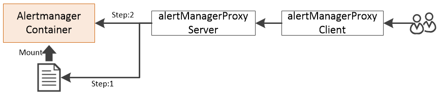

### Description

Update Alertmanager rules through update the mounted rule files. This tool is only for update one rule group , can't add new rule group.

### Workflow



### Usage

- Start server example

  ```
  ./server --rulefiles="/home/rulefiles/*.rule.yaml"
  ```

- Start client example

  ```
  ./client --rulefile=="/home/updatefile.yaml" -t "10.10.10.1:2000"
  ```

  